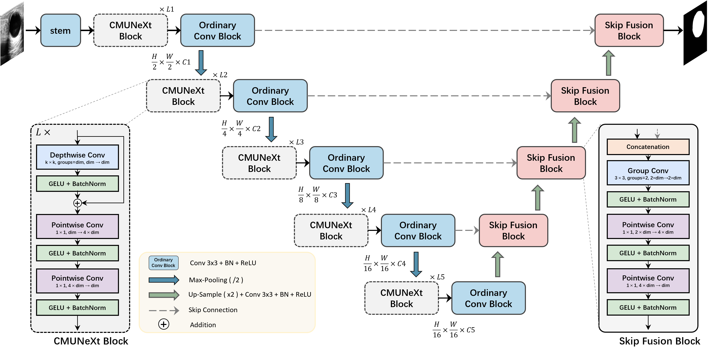
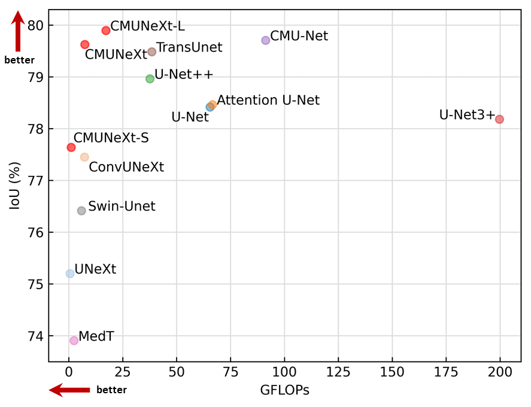
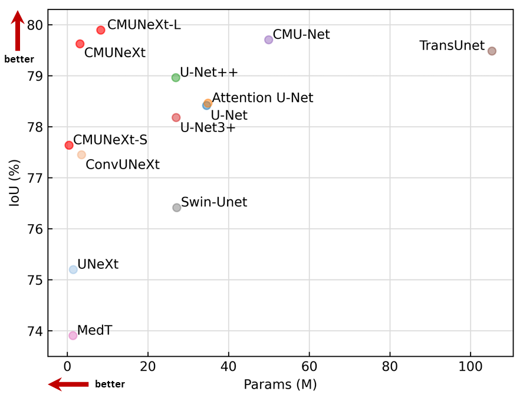
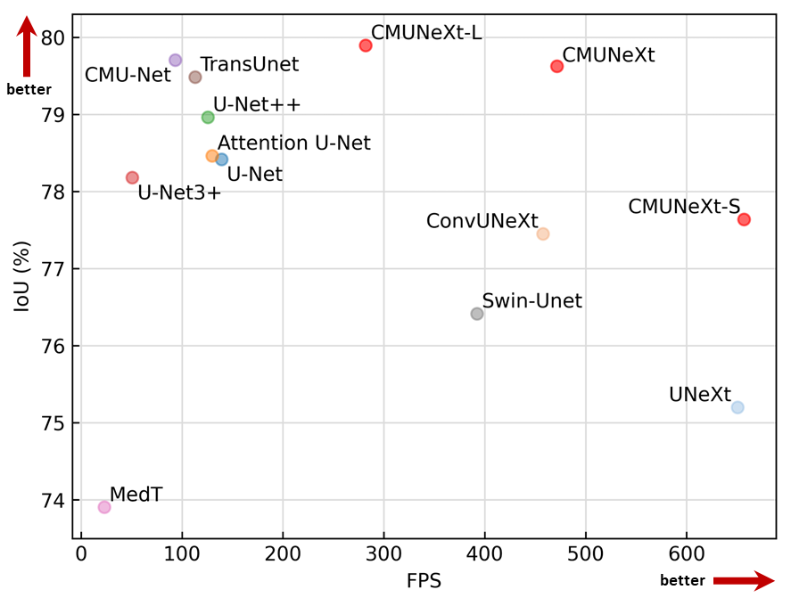

# CMUNeXt: An Efficient Medical Image Segmentation Network based on Large Kernel and Skip Fusion

Official pytorch code base for ISBI 2024 **oral paper** "CMUNeXt: An Efficient Medical Image Segmentation Network based on Large Kernel and Skip Fusion"

[Paper](https://arxiv.org/pdf/2308.01239.pdf) | [Code](https://github.com/FengheTan9/CMUNeXt)

**News** 🥰:
- <font color="#dd0000" size="4">**CMUNeXt is accepted by ISBI 2024 as oral presentation !**</font> 🥰
- <font color="#dd0000" size="4">**Paper is accepted by ISBI 2024 !**</font> 🎉
- <font color="#dd0000" size="4">**Code is released now !**</font> 
- <font color="#dd0000" size="4">**Code will be released soon !**</font> 😘

## Introduction
The U-shaped architecture has emerged as a crucial paradigm in the design of medical image segmentation networks. However, due to the inherent local limitations of convolution, a fully convolutional segmentation network with U-shaped architecture struggles to effectively extract global context information, which is vital for the precise localization of lesions. While hybrid architectures combining CNNs and Transformers can address these issues, their application in real medical scenarios is limited due to the computational resource constraints imposed by the environment and edge devices. In addition, the convolutional inductive bias in lightweight networks adeptly fits the scarce medical data, which is lacking in the Transformer based network. In order to extract global context information while taking advantage of the inductive bias, we propose CMUNeXt, an efficient fully convolutional lightweight medical image segmentation network, which enables fast and accurate auxiliary diagnosis in real scene scenarios. CMUNeXt leverages large kernel and inverted bottleneck design to thoroughly mix distant spatial and location information, efficiently extracting global context information. We also introduce the Skip-Fusion block, designed to enable smooth skip-connections and ensure ample feature fusion. Experimental results on multiple medical image datasets demonstrate that CMUNeXt outperforms existing heavyweight and lightweight medical image segmentation networks in terms of segmentation performance, while offering a faster inference speed, lighter weights, and a reduced computational cost.

### CMUNeXt:



## Performance Comparison

      

## Datasets

Please put the [BUSI](https://www.kaggle.com/aryashah2k/breast-ultrasound-images-dataset) dataset or your own dataset as the following architecture. 
```
└── CMUNeXt
    ├── data
        ├── busi
            ├── images
            |   ├── benign (10).png
            │   ├── malignant (17).png
            │   ├── ...
            |
            └── masks
                ├── 0
                |   ├── benign (10).png
                |   ├── malignant (17).png
                |   ├── ...
        ├── your dataset
            ├── images
            |   ├── 0a7e06.png
            │   ├── ...
            |
            └── masks
                ├── 0
                |   ├── 0a7e06.png
                |   ├── ...
    ├── dataloader
    ├── network
    ├── utils
    ├── main.py
    └── split.py
```
## Environment

- GPU: NVIDIA GeForce RTX4090 GPU
- Pytorch: 1.13.0 cuda 11.7
- cudatoolkit: 11.7.1
- scikit-learn: 1.0.2
- albumentations: 1.2.0

## Training and Validation

You can first split your dataset:

```python
python split.py --dataset_name busi --dataset_root ./data
```

Then, train and validate your dataset:

```python
python main.py --model ["CMUNeXt", "CMUNeXt-S", "CMUNeXt-L"] --base_dir ./data/busi --train_file_dir busi_train.txt --val_file_dir busi_val.txt
```

## Acknowledgements:

This code-base uses helper functions from [Medical-Image-Segmentation-Benchmarks](https://github.com/FengheTan9/Medical-Image-Segmentation-Benchmarks).

## Citation

If you use our code, please cite our paper:

```tex
@article{tang2023cmunext,
  title={CMUNeXt: An Efficient Medical Image Segmentation Network based on Large Kernel and Skip Fusion},
  author={Tang, Fenghe and Ding, Jianrui and Wang, Lingtao and Ning, Chunping and Zhou, S Kevin},
  journal={arXiv preprint arXiv:2308.01239},
  year={2023}
}
```

